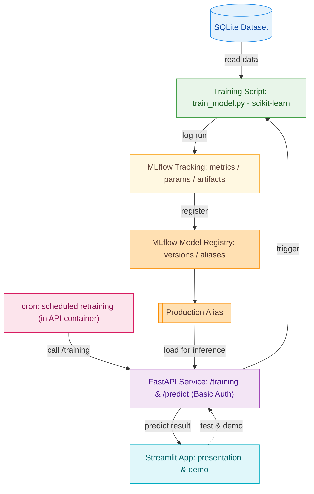

# Rakuten MLOps — End-to-End Machine Learning Pipeline

This repository demonstrates a **complete, reproducible MLOps workflow** built around the *Rakuten Product Classification Challenge*, an e-commerce text classification task.

The goal is **not** to achieve state-of-the-art accuracy, but to design a **fully operational and transparent MLOps system** that covers the entire lifecycle:
> *from data → training → versioning → deployment → monitoring → presentation.*

---

## 1. Project Background and Objectives

### Background: Rakuten Product Classification
The **Rakuten France Product Classification Challenge** focuses on large-scale taxonomy prediction, where each product listing (title + description) must be assigned a `prdtypecode`, representing its category in Rakuten’s taxonomy.

### Why this matters
Accurate classification enables:
- better **search and recommendation systems**
- improved **catalog consistency**
- **automation** of manual labeling tasks at industrial scale

### Project Objectives
1. Build a **reproducible and logged training pipeline**
2. Implement **automatic model versioning** via MLflow Registry
3. Deploy a **secure inference API** (FastAPI)
4. Enable **automated retraining** (via cron job or Airflow)
5. Provide an **interactive Streamlit interface** for demo and presentation

---

## 2. System Architecture Overview




---
## 3. Components Overview

### • SQLite Database**  
Stores all product texts and their corresponding labels used for model training.  
It provides a lightweight and reproducible local data source for the entire workflow.

### • FastAPI**  
Hosts the main endpoints `/training`, `/predict`, and `/predict_batch`, all secured via Basic Authentication.  
It acts as the central hub connecting data access, training, and inference.


### • Training Script (`train_model.py`)**  
Implements a text classification model using TF-IDF + LinearSVC.  
It logs parameters, metrics, and artifacts to MLflow and registers each trained model version automatically.

### • MLflow Tracking & Registry**  
Manages all experiment logs, metrics, and model artifacts.  
The Registry assigns aliases such as `Production` or `Staging`, ensuring transparent model governance.

### • Cron Job (inside API container)**  
Automates retraining by periodically triggering the `/training` endpoint.  
Each run is automatically logged and evaluated to decide if the new model should replace the current Production version.

### • Streamlit App**  
Provides an interactive and visual interface for both presentation and live demonstration.  
Users can trigger retraining, make predictions, and explore model versions and workflow structure.

### • CI/CD with GitHub Actions**  
Ensures continuous integration and deployment through automated workflows (`ci.yaml` and `release.yaml`).  
Includes linting, testing, Docker image building, and optional publishing to DockerHub.

---

## 4. Setup and Run Instructions

### Requirements
- Docker + Docker Compose  
- Git  
- (Optional) Git LFS

```bash
git lfs install
```
### Clone and Build
```bash
git clone https://github.com/<YOUR_USERNAME>/rakuten-mlops.git
cd rakuten-mlops
docker compose build
docker compose up -d
```
### Access the Services
| Component | URL |
|------------|---------------------------------------------|
| **FastAPI** | [http://localhost:8000](http://localhost:8000) |
| **MLflow UI** | [http://localhost:5000](http://localhost:5000) |
| **Streamlit App** | [http://localhost:8501](http://localhost:8501) |

---
##  5. Retraining Logic

- The **API container** contains a cron job that periodically calls the `/training` endpoint.  
- Each run logs metrics and artifacts to **MLflow Tracking**.  
- The system compares the new model’s performance to the previous version using the **macro-F1** score.  
- If the new model performs better, it is automatically promoted to the **Production alias** in MLflow.

Default schedule:  
- **Every 5 minutes** (for demo)  
- **Daily at 02:00** (for production)

To view the cron configuration, run:

```bash
docker compose exec api sh -lc 'crontab -l'
```
---
## 6. CI / CD

| Workflow | Trigger | Steps |
|-----------|----------|----------------------------------------------|
| `ci.yaml` | on push / PR | Install → Lint → Test → Build Docker image |
| `release.yaml` | on tag `vX.Y.Z` | Build and push image to DockerHub |
---
## 7. License and Acknowledgment

This project was developed for **academic demonstration purposes**.  
Dataset © **Rakuten France**.  
Tools used: **FastAPI**, **Streamlit**, **MLflow**, **scikit-learn**, **Docker**, **GitHub Actions**.

---

## Author

*Xiangyu Zhuo*


